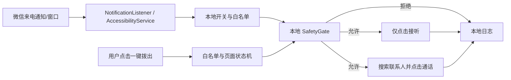

# GrandmaCallAgent

GrandmaCallAgent 是一个面向高龄老人的安卓手机通话 Agent 项目。当前正在实现 `V0: 本地自动化脚本验证`，此阶段不涉及 Agent 能力：

- 微信语音/视频来电的白名单自动接听。
- 本地白名单判断和本地日志。
- 一键拨出微信视频/语音通话。
- 明确禁止支付、转账、红包、删除消息等非通话动作。

当前产品路线以 [V0-V3 演进路线](docs/ROADMAP.md) 为准。仓库中已有的云端服务、WebSocket Bridge、云端 `SafetyGate` 和设备心跳是 `V1: Agent 化` 的骨架与预研基础；V0 只写并验证手机本地自动化脚本/原型能否实现。

## 项目结构

```text
GrandmaCallAgent/
  GrandmaBridge/          # Android/Kotlin 端
  GrandmaAgentServer/     # Python FastAPI 云端
  docs/                   # 架构、权限、测试和运行说明
```

## V0 架构图



V1 才接入 WebSocket、Agent Server、工具 API 和设备心跳。详细架构见 [docs/ARCHITECTURE.md](docs/ARCHITECTURE.md)。

## 安全边界

V0 只允许两类本地通话动作：白名单来电自动接听，以及用户在 GrandmaBridge 内主动触发的白名单一键拨出。它们必须满足：

- `app_package == "com.tencent.mm"`。
- `call_type` 只能是 `voice` 或 `video`。
- 联系人必须精确命中手机本地白名单。
- 每次微信 UI 动作前必须通过本地 `SafetyGate`。
- 页面文本不能包含支付、转账、红包、删除、银行卡等高风险关键词。
- 一键拨出必须从已确认的微信主标签页开始，并逐步确认搜索页、精确联系人和目标聊天页。

不允许发送消息、加好友、读取聊天、支付、转账、红包或删除等非通话动作。

## 本地运行

### V0 Android 真机验证

先运行不依赖 ADB 的脚本自测：

```powershell
.\scripts\v0_self_test.ps1
```

Android 项目包含经过校验的 Gradle 8.9 Wrapper。Android CI 使用 JDK 17 和 Android SDK 35 执行单元测试、Lint 和 debug APK 构建；结果见 [Android V0 workflow](https://github.com/NaritaC/GrandmaCallAgent/actions/workflows/android-v0.yml)。CI 通过只证明代码可构建和静态检查通过，不代替微信真机验证。

然后用 Android Studio 打开 `GrandmaBridge/`，安装到备用手机或测试手机，配置本地白名单并手动授权无障碍服务和通知使用权。完整步骤、安全警示及场景脚本见 [V0 手机验证指南](docs/V0_PHONE_VALIDATION.md)。

### V1 云端骨架（当前 V0 不需要）

```powershell
cd GrandmaAgentServer
python -m venv .venv
.\.venv\Scripts\Activate.ps1
pip install -e ".[dev]"
Copy-Item storage\whitelist.example.json storage\whitelist.json
uvicorn grandma_agent_server.main:app --reload --host 0.0.0.0 --port 8000
```

常用地址：

- 健康检查：`http://127.0.0.1:8000/healthz`
- 工具列表：`http://127.0.0.1:8000/tools`
- 任务日志：`http://127.0.0.1:8000/tasks`

更多运行细节见 [docs/LOCAL_RUN.md](docs/LOCAL_RUN.md)。

## 文档

- [架构说明](docs/ARCHITECTURE.md)
- [权限说明](docs/PERMISSIONS.md)
- [测试清单](docs/TEST_CHECKLIST.md)
- [本地运行方式](docs/LOCAL_RUN.md)
- [演进路线](docs/ROADMAP.md)
- [V0 自动化验证计划](docs/V0_AUTOMATION_VALIDATION.md)
- [V0 手机验证指南](docs/V0_PHONE_VALIDATION.md)
- [V0 验证记录模板](docs/V0_TEST_RECORD_TEMPLATE.md)
- [可参考项目调研](docs/REFERENCE_PROJECTS.md)
- [项目进展日志](docs/PROJECT_LOG.md)

V0 手机验证辅助脚本位于 `scripts/`，包括离线自测、主机预检、构建安装、设备预检、读取日志、清空日志、日志断言、场景化验证和采集验证证据包。

安全默认值：V0 自动接听总开关默认关闭。保存白名单并开启系统权限后，仍需在 App 内手动打开“启用白名单来电自动接听”才会自动接听。

## 当前限制

- 微信 UI 文案可能因版本、语言、系统 ROM 变化，需要在真机上校准按钮文本。
- V0 不做无人值守主动外呼；一键拨出只能由用户在 App 内主动触发，且仅限本地白名单联系人。
- 不发消息、不读聊天内容，不操作支付、转账、红包或删除相关页面。
- Android 端不绕过系统权限，Accessibility 和 Notification Listener 都需要用户手动授权。
