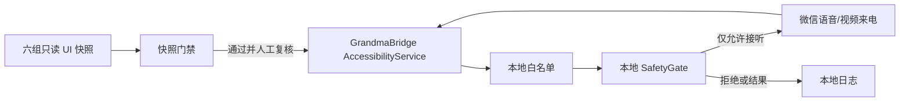

# GrandmaCallAgent

GrandmaCallAgent 是面向高龄老人的 Android 微信通话辅助项目。当前阶段是 **V0-A 固定环境可行性验证**，不使用 Agent 推理：

- 目标手机：`HUAWEI Pura 70 Ultra`
- 系统：`HarmonyOS 4.2.0`
- 微信：`8.0.76`
- 能力：来电识别、本地白名单精确判断、语音/视频自动接听、本地日志

接听方需要运行 Android/HarmonyOS 4.x 兼容 APK；呼叫方只需能使用微信，Android 和 iPhone 均可。多页面“一键拨出”已拆到 **V0.5**，不计入 V0-A 验收。云端 Agent、WebSocket 工具 API 和设备心跳属于 V1。

## 项目结构

```text
GrandmaCallAgent/
  GrandmaBridge/          # Android/Kotlin 本地 Bridge
  GrandmaAgentServer/     # Python/FastAPI V1 骨架
  scripts/                # V0 构建、快照、门禁和实测脚本
  docs/                   # 架构、权限、路线和验证记录
```

## V0-A 架构



六组快照覆盖语音/视频与未锁屏、锁屏亮屏、锁屏熄屏的笛卡尔积。任一组缺少联系人、通话类型、精确接听标签、可点击节点或微信包名信号，均不得启用自动接听。

## 安全边界

- 白名单使用家属维护的唯一微信备注，例如 `V0TEST01`，按标准化后的完整文本精确匹配。
- 微信号可作为辅助配置，但来电 UI 未稳定暴露微信号时不能作为 V0 身份依据。
- 每次点击前必须由本地 `SafetyGate` 重新检查包名、联系人、通话类型和页面风险词。
- 禁止支付、转账、红包、银行卡、验证码、删除、发消息、加好友、读取聊天等非通话动作。
- 自动接听开关默认关闭；快照目录和证据包含敏感界面信息，已从 Git 忽略，禁止上传。

## 快速开始

先运行完全离线的脚本自测：

```powershell
.\scripts\v0_self_test.ps1
```

没有 ADB 时，先阅读并接受 [Android SDK License](https://developer.android.com/studio/terms)，再选择运行：

```powershell
.\scripts\v0_setup_platform_tools.ps1 -AcceptAndroidSdkLicense
```

随后按 [V0 手机验证指南](docs/V0_PHONE_VALIDATION.md) 完成六组只读快照和实机验证。不要跳过快照门禁，也不要在主微信账号或资金页面首测。Android CI 会用 JDK 17、Android SDK 35 和 Gradle 8.9 执行单元测试、Lint 和 debug 构建；CI 通过不等于真机可用。

V1 服务端骨架可独立运行：

```powershell
cd GrandmaAgentServer
python -m venv .venv
.\.venv\Scripts\Activate.ps1
pip install -e ".[dev]"
Copy-Item storage\whitelist.example.json storage\whitelist.json
uvicorn grandma_agent_server.main:app --reload --host 127.0.0.1 --port 8000
```

## 文档

- [演进路线](docs/ROADMAP.md)
- [架构说明](docs/ARCHITECTURE.md)
- [权限说明](docs/PERMISSIONS.md)
- [V0 自动化验证计划](docs/V0_AUTOMATION_VALIDATION.md)
- [V0 手机验证指南](docs/V0_PHONE_VALIDATION.md)
- [GKD 校准说明](docs/V0_GKD_VALIDATION.md)
- [测试清单](docs/TEST_CHECKLIST.md)
- [本地运行方式](docs/LOCAL_RUN.md)
- [可参考项目调研](docs/REFERENCE_PROJECTS.md)
- [项目进展日志](docs/PROJECT_LOG.md)

## 当前状态

代码已通过 CI 构建和离线安全测试，但尚无上述目标手机的真实来电快照或自动接听证据。因此 V0-A 仍是“待真机验证”，不能宣称完成。
