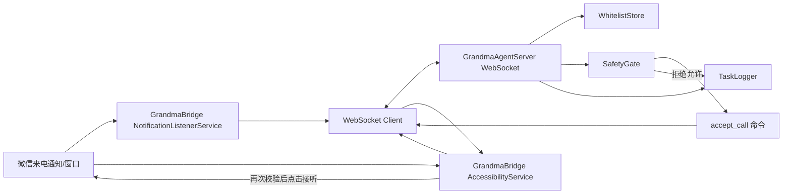

# GrandmaCallAgent

GrandmaCallAgent 是一个面向高龄老人的安卓手机通话 Agent 项目。第一阶段只支持：

- 微信语音/视频来电的白名单自动接听。
- 安卓设备状态心跳上报。
- 所有动作经过云端 `SafetyGate` 判定。
- 明确禁止支付、转账、红包、删除消息等非通话动作。

## 项目结构

```text
GrandmaCallAgent/
  GrandmaBridge/          # Android/Kotlin 端
  GrandmaAgentServer/     # Python FastAPI 云端
  docs/                   # 架构、权限、测试和运行说明
```

## 架构图



详细架构见 [docs/ARCHITECTURE.md](docs/ARCHITECTURE.md)。

## 安全边界

第一阶段只有一个允许工具：`accept_call`。它必须满足：

- `app_package == "com.tencent.mm"`。
- `call_type` 只能是 `voice` 或 `video`。
- 来电联系人必须命中服务端白名单。
- 动作和页面文本不能包含支付、转账、红包、删除、银行卡等高风险关键词。

其他工具请求默认拒绝并写入任务日志。

## 本地运行

### 启动云端服务

```powershell
cd GrandmaAgentServer
python -m venv .venv
.\.venv\Scripts\Activate.ps1
pip install -e ".[dev]"
Copy-Item storage\whitelist.example.json storage\whitelist.json
uvicorn grandma_agent_server.main:app --reload --host 0.0.0.0 --port 8000
```

常用地址：

- 健康检查：`http://127.0.0.1:8000/healthz`
- 工具列表：`http://127.0.0.1:8000/tools`
- 任务日志：`http://127.0.0.1:8000/tasks`

### 运行 Android 端

1. 用 Android Studio 打开 `GrandmaBridge`。
2. 同步 Gradle 后安装到手机或模拟器。
3. 在 App 首页设置 WebSocket 地址：
   - 模拟器访问本机：`ws://10.0.2.2:8000`
   - 真机访问电脑：`ws://<电脑局域网 IP>:8000`
4. 按页面按钮打开系统设置，手动启用：
   - 无障碍服务 `GrandmaBridge`
   - 通知使用权 `GrandmaBridge`
5. 确保 `GrandmaAgentServer/storage/whitelist.json` 中包含允许自动接听的微信联系人显示名。

更多运行细节见 [docs/LOCAL_RUN.md](docs/LOCAL_RUN.md)。

## 文档

- [架构说明](docs/ARCHITECTURE.md)
- [权限说明](docs/PERMISSIONS.md)
- [测试清单](docs/TEST_CHECKLIST.md)
- [本地运行方式](docs/LOCAL_RUN.md)

## 当前限制

- 微信 UI 文案可能因版本、语言、系统 ROM 变化，需要在真机上校准按钮文本。
- 第一阶段不做主动拨号、不发消息、不读聊天内容、不处理支付相关页面。
- Android 端不绕过系统权限，Accessibility 和 Notification Listener 都需要用户手动授权。
