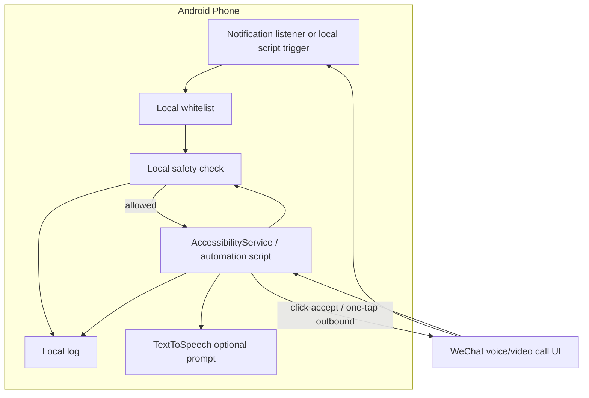
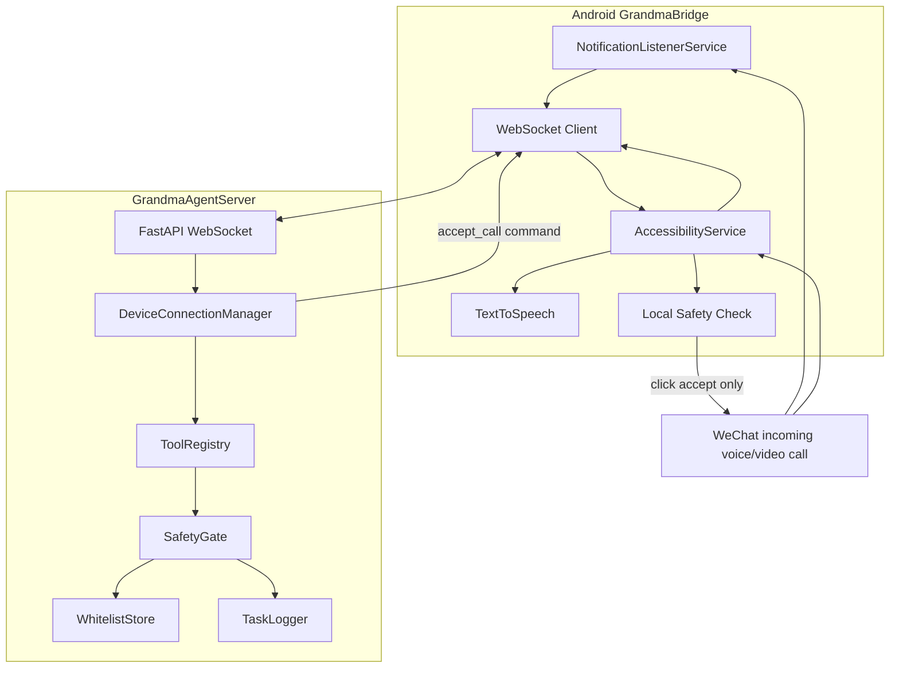

# 架构说明

> 阶段说明：当前产品实现重点是 `V0: 本地自动化脚本验证`。V0 不涉及 Agent 能力，只验证手机本地脚本/无障碍原型能否完成微信来电识别、白名单判断、自动接听、一键拨出和本地日志。本文中的云端 `GrandmaAgentServer`、WebSocket 工具调用和设备状态上报描述的是已搭建的 V1 骨架。

## 目标

V0 目标是证明手机本地自动化可行：微信语音/视频来电识别、白名单本地判断、自动接听、一键拨出和本地日志。系统不执行任何支付、转账、删除消息、发消息等非通话动作。云端连接、设备心跳和 Agent 工具调用属于 V1。

## V0 本地验证组件



## V1 骨架组件



## V0 通话接听验证流程

1. 微信来电出现通知或来电窗口。
2. 本地通知监听、无障碍服务或自动化脚本识别微信语音/视频来电。
3. 本地读取白名单并判断联系人是否允许。
4. 本地安全检查当前窗口必须是微信来电页，并且没有支付、转账、红包、删除等高风险关键词。
5. 本地校验通过后只点击“接听/接受/Answer/Accept”等接听按钮。
6. 本地日志记录识别结果、白名单判断、安全检查和点击结果。

## V1 通话接听流程（骨架）

1. 微信来电出现通知或来电窗口。
2. `WeChatNotificationListener` 或 `GrandmaAccessibilityService` 识别为微信语音/视频来电。
3. `BridgeWebSocketClient` 将 `incoming_wechat_call` 事件发送到云端。
4. 云端 `DeviceConnectionManager` 调用 `ToolRegistry` 中的 `accept_wechat_call`。
5. `SafetyGate` 检查应用包名、通话类型、白名单联系人和高风险关键词。
6. 允许时，云端通过 WebSocket 下发 `accept_call` 命令。
7. Android 无障碍服务再次检查当前窗口必须是微信来电页，并且没有支付/转账/删除等高风险关键词。
8. 本地校验通过后只点击“接听/接受/Answer/Accept”等接听按钮。
9. Android 上报 `action_result`，云端写入任务日志。

## V1 心跳流程（骨架）

1. Android 端每 30 秒发送一次 `heartbeat`。
2. 心跳包含设备型号、系统版本、电量、无障碍服务状态、通知监听状态。
3. 云端记录设备在线状态，可通过 `/devices` 查询。

## 安全设计

- V0 只使用本地白名单、本地安全检查和本地日志，不依赖 Agent 决策。
- V0 只允许微信通话接听和用户主动触发的一键拨出。
- V1 才引入云端或本地 Agent Server 的工具调用和 `SafetyGate` 服务化。
- 默认拒绝未知动作、未知包名、未知通话类型和非白名单联系人。
- 日志必须记录允许、拒绝和执行结果。

## V1 WebSocket 消息示例

设备上报来电：

```json
{
  "type": "incoming_wechat_call",
  "device_id": "android-id",
  "timestamp": 1720000000000,
  "payload": {
    "app_package": "com.tencent.mm",
    "contact_name": "妈妈",
    "call_type": "voice",
    "source": "notification"
  }
}
```

云端下发命令：

```json
{
  "command_id": "uuid",
  "type": "accept_call",
  "task_id": "uuid",
  "payload": {
    "app_package": "com.tencent.mm",
    "contact_name": "妈妈",
    "call_type": "voice"
  }
}
```
