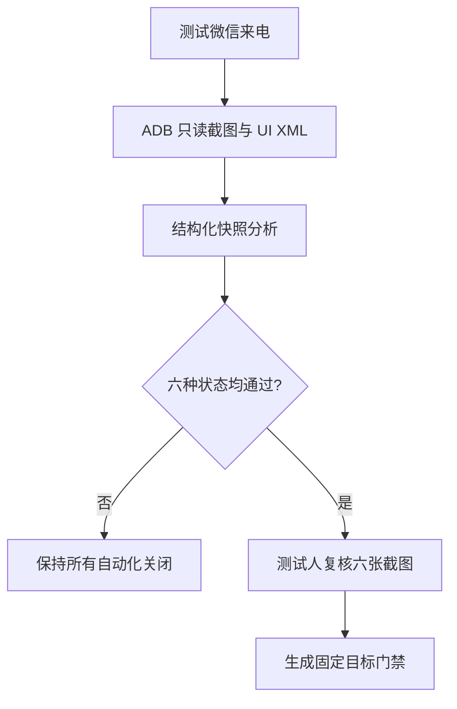
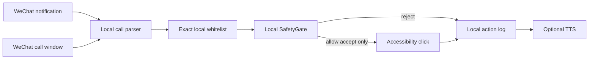
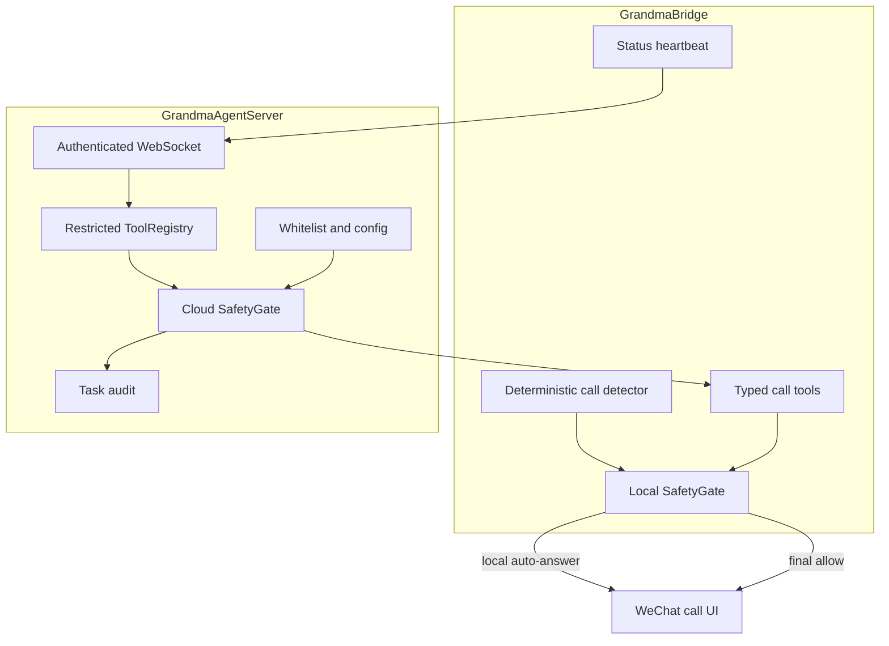

# 架构说明

当前交付重点是 V0-A：在固定手机、系统和微信版本上验证本地白名单自动接听。V0-A 不依赖 Agent、云端或网络；一键拨出属于 V0.5。

## V0-A 快照门禁

六种状态是语音/视频与未锁屏、锁屏亮屏、锁屏熄屏的组合。门禁绑定 `HUAWEI Pura 70 Ultra / HarmonyOS 4.2.0 / WeChat 8.0.76`，任一版本变化后失效。

## V0-A 手机运行时

执行链必须同时确认：

1. 事件和活动窗口属于 `com.tencent.mm`。
2. 通话类型是语音或视频。
3. 来电页显示的唯一备注精确命中本地白名单。
4. 页面有明确通话和接听信号，接听节点启用且可点击。
5. 页面不含支付、转账、红包、银行卡、验证码或删除等风险词。

任何信号缺失都默认拒绝。V0-A Manifest 不含 `INTERNET` 权限，日志和白名单只保存在本地。

## V0.5 一键拨出

V0.5 复用本地白名单和 `SafetyGate`，但使用独立的有限状态机：微信首页确认、搜索入口、精确联系人、目标聊天页、语音/视频入口。它不提供通用坐标、任意选择器或任意文本输入；用户取消、超时、页面歧义、风险词和来电都会终止任务。

## V1 受控 Agent 架构

实时自动接听不经过 LLM。Agent 只能请求明确的通话工具，不能调用通用点击、输入、消息或支付动作。云端允许结果仍需通过手机本地 `SafetyGate`，本地拒绝不可被覆盖。

## V1 消息原则

- 心跳只含设备型号、系统版本、电量和服务授权状态。
- 工具 payload 只含设备、白名单联系人引用和 `voice`/`video` 类型。
- 不上传聊天内容、通知原文、屏幕截图、音视频或通讯录。
- 每个请求和本地执行结果都有命令 ID、时间戳和拒绝原因。
