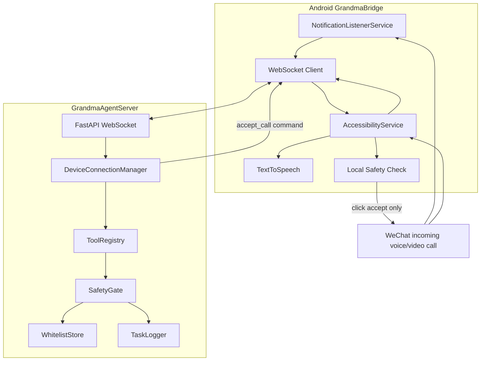

# 架构说明

## 目标

第一阶段目标是让高龄老人手机在微信语音/视频来电时，对白名单联系人自动接听，同时持续向云端上报设备状态。系统不执行任何支付、转账、删除消息、发消息等非通话动作。

## 组件



## 通话接听流程

1. 微信来电出现通知或来电窗口。
2. `WeChatNotificationListener` 或 `GrandmaAccessibilityService` 识别为微信语音/视频来电。
3. `BridgeWebSocketClient` 将 `incoming_wechat_call` 事件发送到云端。
4. 云端 `DeviceConnectionManager` 调用 `ToolRegistry` 中的 `accept_wechat_call`。
5. `SafetyGate` 检查应用包名、通话类型、白名单联系人和高风险关键词。
6. 允许时，云端通过 WebSocket 下发 `accept_call` 命令。
7. Android 无障碍服务再次检查当前窗口必须是微信来电页，并且没有支付/转账/删除等高风险关键词。
8. 本地校验通过后只点击“接听/接受/Answer/Accept”等接听按钮。
9. Android 上报 `action_result`，云端写入任务日志。

## 心跳流程

1. Android 端每 30 秒发送一次 `heartbeat`。
2. 心跳包含设备型号、系统版本、电量、无障碍服务状态、通知监听状态。
3. 云端记录设备在线状态，可通过 `/devices` 查询。

## 安全设计

- 云端是主安全决策点，任何工具执行前必须通过 `SafetyGate`。
- Android 端是第二道安全校验，只允许在微信来电窗口点击接听按钮。
- 默认拒绝未知工具、未知包名、未知通话类型和非白名单联系人。
- 任务日志记录允许、拒绝和执行结果。

## WebSocket 消息示例

设备上报来电：

```json
{
  "type": "incoming_wechat_call",
  "device_id": "android-id",
  "timestamp": 1720000000000,
  "payload": {
    "app_package": "com.tencent.mm",
    "contact_name": "妈妈",
    "call_type": "voice",
    "source": "notification"
  }
}
```

云端下发命令：

```json
{
  "command_id": "uuid",
  "type": "accept_call",
  "task_id": "uuid",
  "payload": {
    "app_package": "com.tencent.mm",
    "contact_name": "妈妈",
    "call_type": "voice"
  }
}
```
